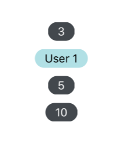

## Badge



### Usage

```javascript
<Badge
  value={3}
  textStyle={{ color: 'white' }}
/>

<Badge containerStyle={{ backgroundColor: 'powderblue'}}>
  <Text>User 1</Text>
</Badge>

<Badge onPress={() => {console.log('pressed')}} value="5" />

<Badge component={TouchableOpacity} value={10} />
```

### Props

| prop | default | type | required | description |
| --- | :---: | :---: | :---: | --- |
| value | none | string or number | optional | text value to be displayed by badge, defaults to empty | 
| containerStyle | inherited styling | object (style) | optional | style for the outer badge component |
| wrapperStyle | inherited styling | object (style) | optional | style for the outer most badge component |
| textStyle | inherited styling | object (style) | optional | style for the text in the badge's value property |
| children | none | React Native Component | optional | override the default badge contents, mutually exclusive with 'value' property |
| onPress | none | function | optional | function called when pressed on the badge |
| component | View, if onPress then TouchableOpacity | React Element | optional | custom component to replace the badge outer component |