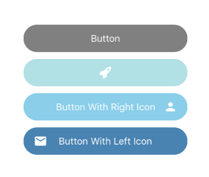

## Button



### Usage

```javascript
<Button
  text={'Button'}
  backgroundColor={'grey'}
  textColor={'white'}
  onClick={() => console.log("Works!")} />

<Button
  backgroundColor={'powderblue'}
  textColor={'white'}
  iconType={'Entypo'}
  iconName={'rocket'}
  iconColor={'white'}
  iconPosition={'center'}
  onClick={() => console.log("Works!")} />

<Button
  text={'Button With Right Icon'}
  backgroundColor={'skyblue'}
  textColor={'white'}
  iconType={'MaterialIcons'}
  iconName={'person'}
  iconColor={'white'}
  iconPosition={'right'}
  onClick={() => console.log("Works!")} />

<Button
  text={'Button With Left Icon'}
  backgroundColor={'steelblue'}
  textColor={'white'}
  iconType={'MaterialIcons'}
  iconName={'mail'}
  iconColor={'white'}
  iconPosition={'left'}
  onClick={() => console.log("Works!")} />
```

### Props

| prop | default | type | required | description |
| --- | :---: | :---: | :---: | --- |
| style | inherited styling | object (style) | optional | style for the outer button component  | 
| backgroundColor | none | string | optional | background color of the button | 
| textFont | none | string | optional | text font of the button | 
| textColor | white | string | optional | text color of the button | 
| marginTop | 5 | number | optional | margin top of the button | 
| marginBottom | 5 | number | optional | margin bottom of the button | 
| width | Dimensions.get('window').width | number or string | optional | width of the button | 
| height | 40 | number or string | optional | height of the button | 
| text | none | string or object | optional | text value to be displayed by button | 
| onClick | none | func | optional | function called when pressed on the button | 
| iconType | none | string | optional | type of the icon | 
| iconName | none | string | optional | name of the icon | 
| iconColor | none | string | optional | color of the icon | 
| iconSize | none | number | optional | size of the icon | 
| iconOutline | none | boolean | optional | determines outline of the icon | 
| iconStyle |  inherited styling | object (style)  | optional | style for the icon | 
| iconPosition | left | left or right or center | optional | position of the icon | 
| raised | false | boolean | optional | flag to add raised button styling  | 