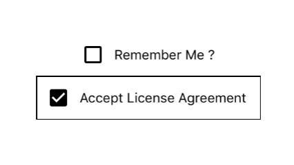

## Checkbox



### Usage

```javascript
<CheckBox
  rightText={'Remember Me ?'}
  onClick={() => this.onClick()}
  isChecked={this.state.checked}
/>

<CheckBox
  checkBoxColor={'black'}
  rightText={'Accept License Agreement '}
  onClick={() => this.onClick()}
  isChecked={true}
  containerStyle={{ borderWidth: 1, borderColor: 'black', padding: 10 }}
/>
```

### Props
| prop | default | type | required | description |
| --- | :---: | :---: | :---: | --- |
| topText | none | string | optional | text value to be displayed above checkbox |
| topTextView | none | React Native Component | optional | custom component to replace the text above checkbox  |
| topTextStyle | inherited styling | object (style) | optional | style for the text above checkbox |
| bottomText | none | string | optional | text value to be displayed below checkbox |
| bottomTextView | none | React Native Component | optional | custom component to replace the text below checkbox |
| bottomTextStyle | inherited styling | object (style) | optional | style for the text below checkbox |
| rightText | none | string | optional | text value to be displayed on the right checkbox |
| rightTextView | none | React Native Component | optional | custom component to replace the text on the right checkbox |
| rightTextStyle | inherited styling | object (style) | optional | style for the text on the right checkbox |
| leftText | none | string | optional | text value to be displayed on the left checkbox |
| leftTextView | none | React Native Component | optional | custom component to replace the text on the left checkbox |
| leftTextStyle | inherited styling | object (style) | optional | style for the text on the left checkbox |
| checkedImage | none | React Native Component | optional | custom component to replace checked image |
| unCheckedImage | none | React Native Component | optional | custom component to replace unchecked image |
| onClick | none | function | optional | callback function for checkbox |
| isChecked | false | boolean | required | flag for checking the checkbox |
| isIndeterminate | false | boolean | required | flag for checking indeterminate the checkbox |
| checkBoxColor | none | string | optional | tint color of the checkbox image |
| disabled | none | boolean | required | flag for disable the checkbox |
| style | inherited styling | object (style) | optional | style for the outer touchable checkbox component |
| containerStyle | inherited styling | object (style) | optional | style for the outer checkbox component |