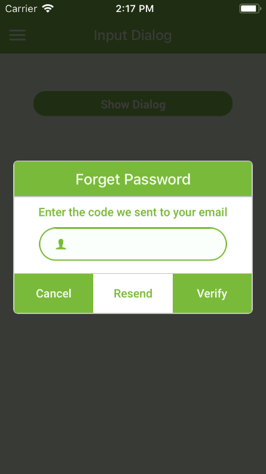
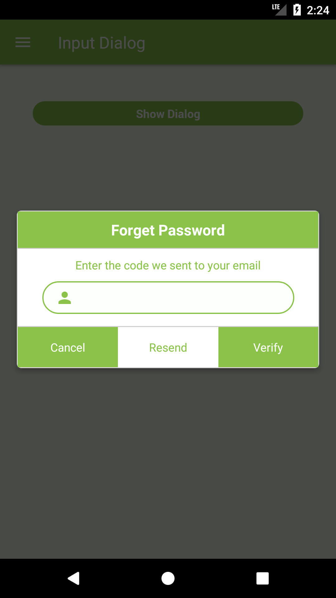

## Dialog Input

### Demo

| iOS | Android |
| --- | ------- |
|  |  |

### Usage

```javascript
import {
  DialogInput
} from 'component';

// Inside render()
<DialogInput
  title="Say something"
  placeholder="Start typing"
  defaultValue="Hello"
  visible={this.state.promptVisible}
  onCancel={() => this.setState({
    promptVisible: false
  })}
  onSubmit={(value) => this.setState({
    promptVisible: false,
    message: `You said "${value}"`
  })}
/>

// Custom Dialog
const dialogInput = (
  <View style={{
    width: '100%',
    flexDirection: 'row',
  }}>
    <FormText
      containerStyle={{
        width: 0,
        flex: 1,
        paddingHorizontal: 20,
        marginBottom: 15
      }}
      border
      borderColor={colors.primary}
      textColor={colors.primary}
      textBackgroundColor={colors.textPrimary}
      placeholderTextColor={colors.textPrimaryDark}
      icon={{ left: { name: 'person', color: colors.primary, style: { left: 40 } } }}
      placeholder={strings.text}
      onChangeText={text => this.setState({ text: text })}
      value={this.state.text} />
    </View>
  );

//Custom Button
  const buttons = [{
    text: 'Cancel',
    onPress: () => {
      this.setState({
        dialogVisible: false,
        text: '',
        message: "You cancelled"
      });
    },
    buttonStyle: {
      backgroundColor: 'green'
    },
  }, {
    text: 'Resend',
    buttonTextStyle: {
      color: 'green'
    },
  }, {
    text: 'Verify',
    onPress: () => {
      this.setState({
        dialogVisible: false,
        text: '',
        message: `You said "${this.state.text}"`
      })
    },
    buttonStyle: {
      backgroundColor: 'green'
    }
  }];

  //Put custom dialog and buttons as props
  <DialogInput
    title="Forget Password"
    dialogTitleStyle={{
      backgroundColor: 'green'
    }}
    titleStyle={{
      color: 'white'
    }}
    dialogBodyText="Enter the code we sent to your email"
    dialogBodyTextStyle={{
      fontWeight: 600
    }}
    animationType="fade"
    placeholder="Start typing"
    dialogInputComponent={dialogInput}
    visible={this.state.dialogVisible}
    buttons={buttons}
  />
```

### Props:

| prop | default | type | required | description |
| --- | :---: | :---: | :---: | --- |
| `animationType` | 'none' | oneOf 'none', 'slide' or 'fade' | optional | Animation type for react-native `Modal` |
| `title` | none | string | optional | The title text of the dialog input |
| `visible` | false | boolean | optional |  When `true`, the dialog is displayed, hide otherwise |
| `defaultValue` | none | string | optional | The default value of the dialog input |
| `placeholder` | none | string | optional | The placeholder text of the prompt |
| `onTapBackground` | none | function | optional | Function that is called when user press on background overlay |
| `onCancel` | none | function | optional | Function that is called when user press on cancel button |
| `cancelText` | none | string | optional | The string that is displayed on the cancel button (defaults to "Cancel") |
| `onSubmit` | none | function | optional | Function that is called with user's value when they submit |
| `submitText` | none | string | optional | The string that is displayed on the submit button (defaults to "OK") |
| `onChangeText` | none | function | optional | Function that is called with user input when it changes |
| `borderColor` | none | string | optional | Border color of the dialog input |
| `dialogStyle` | inherited styling | Object (View style) | optional | Style of the dialog input |
| `dialogTitleStyle` | inherited styling | Object (View style) | optional | Style of the dialog title container |
| `titleStyle` | inherited styling | Object (Text style) | optional | Style of the title text |
| `dialogBodyComponent` | none | element or `React.Component` | optional | Custom body component |
| `dialogBodyText` | none | string | optional | Dialog body message text |
| `dialogBodyTextStyle` | inherited styling | Object (Text style) | optional | Style of the dialog body message text |
| `dialogInputComponent` | none | element or `React.Component` | optional | Custom text input component |
| `buttons` | [] | array Of [object](#buttons-props) | optional | For more than 2 default buttons (cancel and submit) you can add custom button with array of [object](#buttons-props) |
| `buttonStyle` | inherited styling | Object (View style) | optional | Style of all button |
| `buttonTextStyle` | inherited styling | Object (Text style) | optional | Style of all Button Text |
| `submitButtonStyle` | inherited styling | Object (View style) | optional | Style of Submit Button | 
| `submitButtonTextStyle` | inherited styling | Object (Text style) | optional | Style of Submit Button Text |
| `cancelButtonStyle` | inherited styling | Object (View style) | optional | Style of Cancel Button | 
| `cancelButtonTextStyle` | inherited styling | (Text style) | optional | Style of Cancel Button Text |
| `inputStyle` | inherited styling | Object (TextInput style) | optional | Style of default `TextInput` |
| `textInputProps` | inherited styling | object | optional | Additional props on the input element |

#### Buttons Props:


| prop | default | type | required | description |
| --- | :---: | :---: | :---: | --- |
| `text` | none | string | required | Text that will be displayed on the button |
| `onPress` | none | function | optional | Function that will be called when the button is pressed |
| `buttonStyle` | none | Object (View style) | optional | Style for this button (will replace default global props)
| `buttonTextStyle` | none | Object (Text style) | optional | Style for this text button (will replace global buttonTextStyle props)