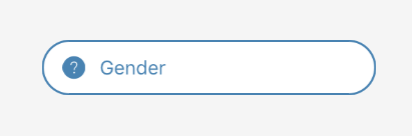

## Form Chooser


<br />


### Usage

```javascript
constructor(props) {
  super(props);
  this.state = {
    gender: null
  };
}

const genders = [{
  key: 0,
  label: 'Male',
  icon: 'male'
}, {
  key: 1,
  label: 'Female',
  icon: 'female'
}];

<FormChooser
  border
  borderColor={'steelblue'}
  data={genders}
  icon={{
    name: this.state.gender ? this.state.gender.icon : 'help-circle',
    color: 'steelblue'
  }}
  placeholderTextColor={'steelblue'}
  placeholder={'Gender'}
  textColor={'steelblue'}
  textBackgroundColor={'steelblue'}
  value={
    this.state.gender ? this.state.gender.label : this.state.gender
  }
  onChange={option => {
    this.setState({
      gender: option,
    })
  }}
/>
```

### Props
| prop | default | type | required | description |
| --- | :---: | :---: | :---: | --- |
| data | none | array[{key , label}] | required | array of objects with a unique key and label to select in the modal | 
| onChange | none | func | optional | callback function, when the users has selected an option | 
| initValue | none | string | optional | text that is initially shown on the button | 
| border | false | boolean | optional | determines border of the form text | 
| borderColor | black | string | optional | color of the boder form text | 
| icon | none | object { name, type, size, color, outline } | optional | source icon of the form text | 
| iconPosition | left | left or right | optional | position icon on form text | 
| placeholder | none | string | optional | placeholder of the form text | 
| placeholderTextColor | none | string | optional | color of the placeholder form text | 
| textColor | none | string | optional | color of the form text | 
| animationType | none | string | optional | type of animation to be used to show the modal. Must be one of none, slide or fade. | 
| style | inherited styling | object (style) | optional | style for the outer form chooser component |
| optionStyle | inherited styling | object (style) | optional | style for the outer option | 
| optionTextStyle | inherited styling | object (style) | optional | style for the option text | 
| optionContainerStyle | inherited styling | object (style) | optional | style for the option container | 
| sectionStyle | inherited styling | object (style)| optional | style for the section container | 
| sectionTextStyle | inherited styling | object (style) | optional | style for the section text | 
| cancelStyle | inherited styling | object (style) | optional | style for the cancel container | 
| cancelTextStyle | inherited styling | object (style) | optional | style for the cancel text | 
| overlayStyle | inherited styling | object (style) | optional | tyle for the overlay modal | 
| cancelText | Cancel | string | optional | text value to be displayed in cancel button | 
| disabled | false | boolean | optional | flag for disable opening of the modal | 
| supportedOrientations | ['portrait', 'landscape'] | array ['portrait', 'landscape', 'portrait-upside-down', 'landscape-left', 'landscape-right'] | optional | orientations the modal supports | 
| keyboardShouldPersistTaps | always | string or boolean | optional | passed to underlying ScrollView | 