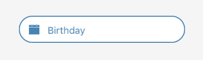

## Form Date Picker


<br />


### Usage

```javascript
constructor(props) {
  super(props);
  this.state = {
    birthday: null
  };
}

<FormDatePicker
  border
  borderColor={'steelblue'}
  date={this.state.birthday}
  format="DD MMMM YYYY"
  maxDate={new Date()}
  iconColor={'steelblue'}
  placeholderTextColor={'steelblue'}
  placeholder={'Birthday'}
  textColor={'steelblue'}
  androidMode="calendar"
  onDateChange={(date) => this.setState({
    birthday: date
  })}
/>
```

### Props
| prop | default | type | required | description |
| --- | :---: | :---: | :---: | --- |
| border | false | boolean | optional | determines border of the form text |
| borderColor | none | string | optional | color of the boder form text |
| iconColor | none | string | optional | color of the icon |
| iconPosition | left | left or right | optional | position icon on form text |
| iconSize | 20 | number | optional | size of the icon |
| iconOutline | false | boolean | optional | outline of the icon |
| iconComponent | none | element | optional | copmonent of the icon |
| mode | date | date or datetime or time | optional | determines the mode of date picker |
| androidMode | default | calendar or spinner or default | optional | determines the android mode of date picker |
| date | none | string or date | optional | specify the display date of date picker. string type value must match the specified format |
| format | MMMM-DD-YYYY | string | optional | specify the display format of the date, which using moment.js. the default value change according to the mode |
| minDate | none | string or date | optional | restricts the min range of possible date values |
| maxDate | none | string or date | optional | restricts the max range of possible date values |
| iosModalHeight | 259 | number | optional | set size height for ios modal |
| duration | 300 | number | optional | specify the animation duration of date picker |
| confirmBtnText | Confirm | string | optional | text value to be displayed in confirm button |
| cancelBtnText | Cancel | string | optional | text value to be displayed in cancel button |
| placeholder | none | string | optional | placeholder of the form text |
| placeholderTextStyle | inherited styling | object (style) | optional | style for the placeholder text |
| placeholderTextColor | none | string | optional | color of the placeholder form text |
| textColor | none | string | optional | color of the form text |
| datePickerStyle | inherited styling | object (style) | optional | style for the date picker |
| dateTextStyle | inherited styling | object (style) | optional | style for the date text |
| dateIconStyle | inherited styling | object (style) | optional | style for the date icon |
| dateInputStyle | inherited styling | object (style) | optional | style for the date input |
| disabledStyle | inherited styling | object (style)| optional | style for the disabled |
| dateTouchBodyStyle | inherited styling | object (style) | optional | style for the date touch body |
| datePickerConStyle | inherited styling | object (style) | optional | style for the date picker container  |
| datePickerStyle | inherited styling | object (style) | optional | style for the date picker |
| btnCancelStyle | none | none | optional | style for the cancel container |
| btnTextCancelStyle | inherited styling | object (style)| optional | style for the cancel text |
| btnConfirmStyle | none | none | optional | style for the confirm container |
| btnTextConfirmStyle | inherited styling | object (style) | optional | style for the confirm text |
| showIcon | true | boolean | optional | determines to show or hide the icon |
| disabled | false | boolean | optional | flag for disable date picker |
| hideText | false | boolean | optional | lag for hide or show the text |
| onDateChange | none | func | optional | callback function, when the users has change the date |
| onOpenModal | none | func | optional | callback function, when the users has open the modal |
| onCloseModal | none | func | optional | callback function, when the users has close the modal |
| onPressMask | none | func | optional | callback function, when the users has press the mask |
| modalOnResponderTerminationRequest | e => true | func | optional | set the callback for React Native's [Gesture Responder System](https://facebook.github.io/react-native/docs/gesture-responder-system.html#responder-lifecycle)'s call to onResponderTerminationRequest. |
| is24Hour | none | boolean | optional | set the time picker is24Hour flag, the default value depend on format, only work in Android |
| TouchableComponent | TouchableHighlight | Component | optional | replace the TouchableHighlight with a custom Component. for example : TouchableOpacity |