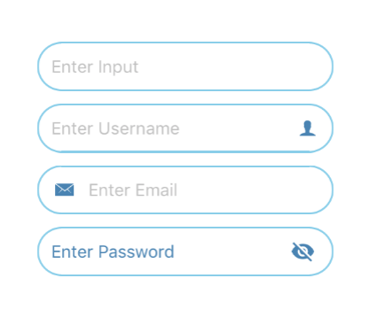

## Form Text



### Usage

```javascript
<FormText
  border
  borderColor={'skyblue'}
  placeholder={'Enter Input'} />

<FormText
  border
  borderColor={'skyblue'}
  icon={{ right: { name: 'person', color: 'steelblue' } }}
  placeholder={'Enter Username'} />

<FormText
  border
  borderColor={'skyblue'}
  icon={{ left: { name: 'mail', color: 'steelblue' } }}
  placeholder={'Enter Email'} />
  
<FormText
  border
  borderColor={'skyblue'}
  textColor={'steelblue'}
  textBackgroundColor={'white'}
  placeholderTextColor={'steelblue'}
  placeholder={'Enter Password'}
  isPassword={true}
  passwordIconColor={'steelblue'}
  secureTextEntry={true}
  onChangeText={input => this.setState({ input })}
  value={this.state.input} />
```

### Props
| prop | default | type | required | description |
| --- | :---: | :---: | :---: | --- |
| icon | none | object(left or right) {size, name, type, color, outline, style} | optional | source icon of the form text | 
| placeholder | none | none | optional | placeholder of the form text | 
| autoCorrect | false | boolean | optional | determines autocorrect of the form text | 
| autoCapitalize | none | string | optional | auto captialize of the form text | 
| border | false | boolean | optional | determines border of the form text | 
| borderColor | black | string | optional | color of the boder form text | 
| borderWidth | 1.5 | number | optional | width of the boder form text | 
| editable | true | boolean | optional | determines the form text is editable | 
| fontFamily | none | none | optional | specify different font family | 
| isPassword | false | boolean | optional | determines type of the form text | 
| passwordIconPosition | right | left or right | optional | position password icon on form text | 
| passwordIconColor | black | string | optional | color of the password icon | 
| passwordIconSize | none | string | optional | size of the password icon | 
| maxLength | none | number | optional | max length of form text | 
| returnKeyType | done | string | optional | return key type keyboard | 
| secureTextEntry | none | boolean | optional | set secure text entry | 
| onChangeText | none | func | optional | function called when text is change | 
| placeholderTextColor | silver | string | optional | color of the placeholder form text | 
| textColor | black | string | optional | color of the form text  | 
| textSize | 14 | number | optional | size of the form text | 
| textBackgroundColor | white | string | optional | background color of the form text | 
| value | none | string | optional | value of the form text | 