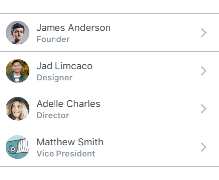
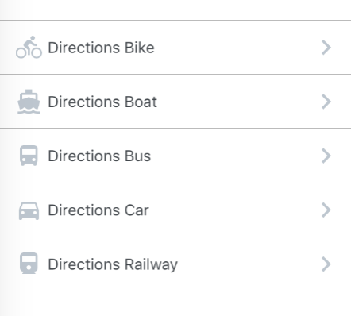
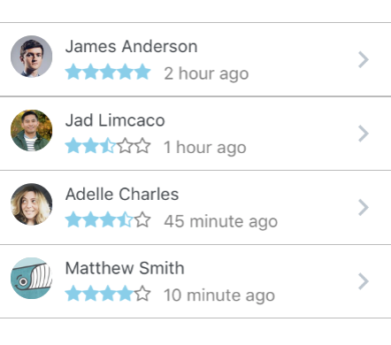
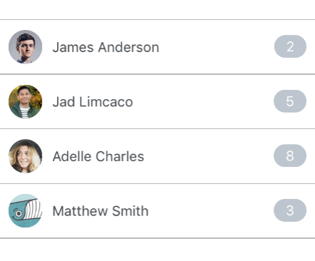
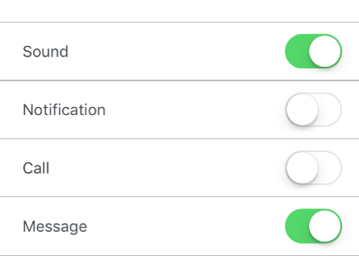
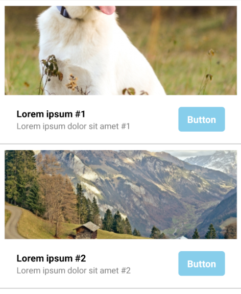

## List

### Usage
- [Using Map Function. Implemented with avatar.](#using-map-function-implemented-with-avatar-)
- [Using RN ListView. Implemented with avatar.](#using-rn-listview-implemented-with-avatar-)
- [Using Map Function. Implemented with icon.](using-map-function-implemented-with-icon-.md)
- [Using RN ListView. Implemented with custom avatar component and  custom view for subtitle.
](#using-rn-listview-implemented-with-custom-avatar-component-and-custom-view-for-subtitle-)
- [Using RN ListView. Implemented with badge.](#using-rn-listview-implemented-with-badge-)
- [Using RN ListView. Implemented with switch.](#using-rn-listview-implemented-with-switch-)
- [Using RN ListView. Implemented with custom header and footer.](#using-rn-listview-implemented-with-custom-header-and-footer-)

#### Using Map Function. Implemented with avatar.



```javascript
const list = [
  {
    name: 'James Anderson',
    avatar_url: 'https://s3.amazonaws.com/uifaces/faces/twitter/jsa/128.jpg',
    subtitle: 'Founder'
  },
  {
    name: 'Jad Limcaco',
    avatar_url: 'https://s3.amazonaws.com/uifaces/faces/twitter/jadlimcaco/128.jpg',
    subtitle: 'Designer'
  },
  ... // more items
]

<List>
  {
    list.map((item, index) => (
      <ListItem
        roundAvatar
        avatar={{uri:item.avatar_url}}
        key={index}
        title={item.name}
        subtitle={item.subtitle}
      />
    ))
  }
</List>
```

#### Using RN ListView. Implemented with avatar.

```javascript

constructor(props) {
  super(props);

  var ds = new ListView.DataSource({rowHasChanged: (r1, r2) => r1 !== r2})

  this.state = {
    dataSource: ds.cloneWithRows([
      {
        name: 'James Anderson',
        avatar_url: 'https://s3.amazonaws.com/uifaces/faces/twitter/jsa/128.jpg',
        subtitle: 'Founder'
      },
      {
        name: 'Jad Limcaco',
        avatar_url: 'https://s3.amazonaws.com/uifaces/faces/twitter/jadlimcaco/128.jpg',
        subtitle: 'Designer'
      },
      ... // more items
    ])
  }
}

renderRow (rowData, sectionID, rowID) {
  return (
    <ListItem
      roundAvatar
      avatar={{uri:rowData.avatar_url}}
      key={rowID}
      title={rowData.name}
      subtitle={rowData.subtitle}
    />
  )
}

<List>
  <ListView
    enableEmptySections={true}
    dataSource={this.state.dataSource}
    renderRow={this.renderRow.bind(this)}/>
</List>
```

#### Using Map Function. Implemented with icon.



```javascript
const list = [
  {
    name: 'Directions Car',
    icon: {
      type : 'MaterialIcons',
      name : 'directions-car'
    }
  },
  {
    name: 'Directions Bus',
    icon: {
      type : 'MaterialIcons',
      name : 'directions-bus'
    }
  ... // more items
]

<List>
  {
    list.map((item, index) => (
      <ListItem
        key={index}
        title={item.name}
        leftIcon={{
          type: item.icon.type, 
          name: item.icon.name
        }}
      />
    ))
  }
</List>
```

#### Using RN ListView. Implemented with custom avatar component and  custom view for subtitle.



```javascript
constructor(props) {
  super(props);

  var ds = new ListView.DataSource({rowHasChanged: (r1, r2) => r1 !== r2})

  this.state = {
    dataSource: ds.cloneWithRows([
      {
        name: 'James Anderson',
        avatar_url: 'https://s3.amazonaws.com/uifaces/faces/twitter/jsa/128.jpg',
        subtitle: 'Founder',
        rating: 5,
        time: '2 hour ago'
      },
      {
        name: 'Jad Limcaco',
        avatar_url: 'https://s3.amazonaws.com/uifaces/faces/twitter/jadlimcaco/128.jpg',
        subtitle: 'Designer',
        rating: 2.5,
        time: '1 hour ago'
      },
      ... // more items
    ])
  }
}

renderRow (rowData, sectionID, rowID) {
  return (
    <ListItem
      avatar={<Avatar
              rounded
              source={rowData.avatar_url && {uri: rowData.avatar_url}}
            />}
      key={rowID}
      title={rowData.name}
      subtitle={rowData.subtitle}
      subtitle={
        <View style={styles.subtitleView}>
          <RatingBar
            maxStars={5}
            rating={rowData.rating}
            starSize={15}
            starColor={'skyblue'}
          />
          <Text style={styles.ratingText}>{rowData.time}</Text>
        </View>
      }
    />
  )
}

<List>
  <ListView
    enableEmptySections={true}
    dataSource={this.state.dataSource}
    renderRow={this.renderRow.bind(this)}/>
</List>

const styles = StyleSheet.create({
  subtitleView: {
    flexDirection: 'row',
    paddingLeft: 10,
    paddingTop: 5
  },
  ratingText: {
    paddingLeft: 10,
    color: 'grey'
  }
})
```

#### Using RN ListView. Implemented with badge.



```javascript

constructor(props) {
  super(props);

  var ds = new ListView.DataSource({rowHasChanged: (r1, r2) => r1 !== r2})

  this.state = {
    dataSource: ds.cloneWithRows([
      {
        name: 'James Anderson',
        avatar_url: 'https://s3.amazonaws.com/uifaces/faces/twitter/jsa/128.jpg',
        badge: '2'
      },
      {
        name: 'Jad Limcaco',
        avatar_url: 'https://s3.amazonaws.com/uifaces/faces/twitter/jadlimcaco/128.jpg',
        badge: '5'
      },
      ... // more items
    ])
  }
}

renderRow (rowData, sectionID, rowID) {
  return (
   <ListItem
    avatar={{uri:rowData.avatar_url}}
    roundAvatar
    key={rowID}
    title={rowData.name}
    badge={{ 
      value: rowData.badge, 
      textStyle: { color: 'white' },
      containerStyle: {
        backgroundColor: '#bdc6cf',
        marginTop: 5
      } 
    }}
    hideChevron={true}
  />
  )
}

<List>
  <ListView
    enableEmptySections={true}
    dataSource={this.state.dataSource}
    renderRow={this.renderRow.bind(this)}/>
</List>
```

#### Using RN ListView. Implemented with switch.



```javascript

constructor(props) {
  super(props);

  var ds = new ListView.DataSource({rowHasChanged: (r1, r2) => r1 !== r2})

  this.state = {
    dataSource: ds.cloneWithRows([
      {
        name: 'James Anderson',
        avatar_url: 'https://s3.amazonaws.com/uifaces/faces/twitter/jsa/128.jpg',
        badge: '2'
      },
      {
        name: 'Jad Limcaco',
        avatar_url: 'https://s3.amazonaws.com/uifaces/faces/twitter/jadlimcaco/128.jpg',
        badge: '5'
      },
      ... // more items
    ])
  }
}

renderRow (rowData, sectionID, rowID) {
  return (
   <ListItem
    key={rowID}
    title={rowData.name}
    hideChevron={true}
    switchButton
    switched={rowData.switch}
  />
  )
}

<List>
  <ListView
    enableEmptySections={true}
    dataSource={this.state.dataSource}
    renderRow={this.renderRow.bind(this)}/>
</List>
```

#### Using RN ListView. Implemented with custom header and footer.



```javascript

constructor(props) {
  super(props);

  var ds = new ListView.DataSource({rowHasChanged: (r1, r2) => r1 !== r2})

  this.state = {
    dataSource: ds.cloneWithRows([
      {
        thumbnail: 'https://placeimg.com/640/480/animals',
        title: 'Lorem ipsum #1',
        subtitle: 'Lorem ipsum dolor sit amet #1'
      },
      {
        thumbnail: 'https://placeimg.com/640/480/nature',
        title: 'Lorem ipsum #2',
        subtitle: 'Lorem ipsum dolor sit amet #2'
      },
      ... // more items
    ])
  }
}

renderHeader(rowData) {
  return (
    <View style={styles.containerHeader}>
      <Image
        style={styles.imageThumbnail}
        source={rowData.thumbnail && {uri: rowData.thumbnail}}
      />
    </View>
  );
}

renderFooter(rowData) {
  return (
    <View style={styles.containerFooter}>
      <View style={styles.rowLeft}>
        <Text style={styles.textTitle}>{rowData.title}</Text>
        <Text style={styles.textSubtitle}>{rowData.subtitle}</Text>
      </View>
      <View style={styles.rowRight}>
        <TouchableOpacity style={styles.containerButton}>
          <Text style={styles.textButton}>
            Button
          </Text>
        </TouchableOpacity> 
      </View>
    </View>  
  );
}

renderRow (rowData, sectionID, rowID) {
  return (
    <ListItem
      key={rowID}
      header={this.renderHeader(rowData)}
      footer={this.renderFooter(rowData)}
      hideChevron={true}
    />
  )
}

<List>
  <ListView
    enableEmptySections={true}
    dataSource={this.state.dataSource}
    renderRow={this.renderRow.bind(this)}/>
</List>

const styles = StyleSheet.create({
  containerHeader: {
    flex: 1,
    width: '100%'
  },
  imageThumbnail: {
    width: '100%',
    height: 150,
    marginBottom: 10 
  },
  containerFooter: {
    flex: 1,
    width: '100%',
    flexDirection: 'row',
    justifyContent: 'center',
    alignItems: 'center',
    paddingVertical: 10,
    paddingHorizontal: 20 
  },
  rowLeft: {
    flex: 2,
    flexDirection: 'column',
    alignItems: 'flex-start',
    justifyContent: 'center'
  },
  rowRight: {
    flex: 1,
    flexDirection: 'column',
    alignItems: 'flex-end',
    justifyContent: 'center'
  },
  textTitle: {
    color: 'black',
    fontWeight: 'bold',
    fontSize: 16
  },
  textSubtitle: {
    color: 'grey',
    fontSize: 14
  },
  containerButton: {
    backgroundColor: 'skyblue',
    borderRadius: 5,
    paddingHorizontal: 15,
    paddingVertical: 10
  },
  textButton: {
    fontSize: 16,
    fontWeight: 'bold',
    color: 'white',
    textAlign: 'center'
  },
})
```

### Props List
| prop | default | type | required | description |
| --- | :---: | :---: | :---: | --- |
| containerStyle | marginTop: 20, borderTopWidth: 1, borderBottomWidth: 1, borderBottomColor: #cbd2d9 | object (style) | optional | style for the list container |

### Props List Item
| prop | default | type | required | description |
| --- | :---: | :---: | :---: | --- |
| onPress | none | func | optional | onPress method for link |
| onLongPress | none | func | optional | onLongPress method for link |
| underlayColor | white | string | optional | define underlay color for TouchableHighlight |
| containerStyle | inherited styling | object (style) | optional | style for the list item container |
| component | View or TouchableHighlight if onPress method is added as prop | React Native element | optional | replace element with custom element (optional) |
| wrapperStyle | inherited styling | object (style) | optional | style for the outer list item component | 
| fontFamily | HelveticaNeue (iOS), Sans Serif (android) |string | optional | specify different font family |
| leftIcon | none | object {name, color, style, type} (type defaults to material icons) <br/><br/> OR <br/><br/> react native element | optional | source icon for the left icon |
| leftIconContainerStyle | inherited styling | object (style) | optional | style for the list icon container |
| avatarStyle | inherited styling | object (style) | optional | style for the avatar |
| avatarContainerStyle | inherited styling | object (style) | optional | style for the avatar container |
| avatarOverlayContainerStyle | inherited styling | object (style) | optional | style for the avatar overlay container |
| roundAvatar | false | boolean | optional | make left avatar round |
| titleContainerStyle | inherited styling | object (style) | optional | style for the title container |
| titleNumberOfLines | 1 | number | optional | number of lines for title |
| title | none | string, number or object | optional | main title for list item, can be text or custom view |
| titleStyle | inherited styling | object (style) | optional | style for the title |
| subtitleContainerStyle | inherited styling | object (style) | optional | style for the subtitle container |
| subtitle | none | string, number or object | optional | subtitle text or custom view |
| subtitleStyle | inherited styling | object (style) | optional | style for the subtitle |
| subtitleNumberOfLines | 1 | number | optional | number of lines for subtitle |
| rightTitle | none | string | optional | provide a rightTitle to have a title show up on the right side of the button |
| rightTitleContainerStyle | inherited styling | object (style) | optional | style for the right title container |
| rightTitleStyle | inherited styling | object (style) | optional | style for the right title |
| rightTitleNumberOfLines | 1 | number | optional | number of lines for right title |
| badge | none | object, accepts the following properties: value (string), containerStyle (object), textStyle (object). You can override the default badge by providing your own component with it's own styling by providing badge={{ element: }} | optional | add a badge to the ListItem by using this prop |
| hideChevron | false | boolean | optional | set if you do not want a chevro  |
| chevronColor | #bdc6cf | string | optional | set chevron color |
| rightIcon | { type: 'MaterialIcons', name: 'chevron-right', size: 28 } | object {name, color, style, type} (type defaults to material icons) <br/><br/> OR <br/><br/> react native element | optional | source icon for the right icon |
| switchButton | false | boolean | optional | add a switch to the right side of your component (note: in order to display the switchButton you need to add the `hideChevron` |
| onSwitch | none | func | optional | add a callback function when the switch is toggled |
| switchDisabled | false | boolean | optional | if true the user won't be able to toggle the switch |
| switchOnTintColor | none | string | optional | background color when the switch is turned on |
| switchThumbTintColor | none | string | optional | color of the foreground switch grip |
| switchTintColor | none | string | optional | border color on iOS and background color on Android when the switch is turned off |
| switched | false | boolean | optional | the value of the switch. if true the switch will be turned on |
| label | none | react native component | optional | add a label with your own styling by providing a label={} prop to ListItem |
| header | none | react native component | optional | add a header with your own styling by providing a header={} prop to ListItem |
| footer | none | react native component | optional | add a footer with your own styling by providing a footer={} prop to ListItem |