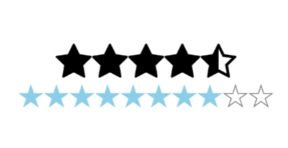

## RatingBar



### Usage

```javascript
<RatingBar
  maxStars={5}
  rating={4.5}
/>

<RatingBar
  starColor={'skyblue'}
  emptyStar={'star-outline'}
  fullStar={'star'}
  halfStar={'star-half'}
  iconSet={'Ionicons'}
  starSize={30}
  maxStars={10}
  rating={this.state.starCount}
  selectedStar={(rating) => this.onStarRatingPress(rating)}
/>
```

### Props
| prop | default | type | required | description |
| --- | :---: | :---: | :---: | --- |
| emptyStar | star-o | string or number or object | optional | name of the empty star |
| fullStar | star | string or number or object | optional | name of the full star |
| halfStar | star-half-o | string or number or object | optional | name of the half star |
| iconSet | FontAwesome | string | optional | type of the icon |
| maxStars | 5 | number | optional | max total star for the ratingbar |
| rating | 0 | number | optional | value star for the ratingbar  |
| selectedStar | none | func | optional | callback function for ratingbar |
| emptyStarColor | gray | string | optional | color of the empty star |
| starColor | black | string | optional | color of the star |
| starSize | 40 | number | optional | size of the star |
| starStyle | inherited styling | object (style) | optional | style for the star ratingbar component | |
| buttonStyle | inherited styling | object (style) | optional | style for the button ratingbar component |
| halfStarEnabled | false | boolean | optional | flag for enable half star on the ratingbar |
| disabled | false | boolean | optional | flag for disable the ratingbar |
| reversed | false | boolean | optional | flag for reversed the ratingbar |