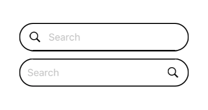

## Search Bar



### Usage

```javascript
<SearchBar
  border
  placeholder={'Search'}
  onChange={input => this.setState({ input })} />
  
<SearchBar
  border
  iconPosition={'right'}
  placeholder={'Search'}
  onChange={input => this.setState({ input })} />
```

### Props

| prop | default | type | required | description |
| --- | :---: | :---: | :---: | --- |
| border | false | bool | none | determines border of the form text | 
| iconPosition | left | left or right | none | position of the icon | 
| placeholder | Search | string | none | placeholder of the form text | 
| onChange | none | func | optional | function called when text is change |
| returnKeyType | search | string | none | return key type keyboard | 
