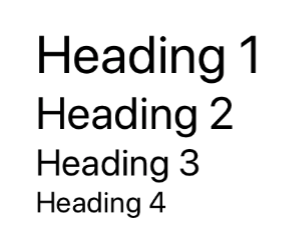

## Text



### Usage

```javascript
<Text h1>Heading 1</Text>
<Text h2>Heading 2</Text>
<Text h3>Heading 3</Text>
<Text h4>Heading 4</Text>
```

### Props

| prop | default | type | required | description |
| --- | :---: | :---: | :---: | --- |
| style | none | object (style) | optional | add additional styling for text | 
| h1 | none | boolean | optional | set font size to 40 | 
| h2 | none | boolean | optional | set font size to 34 | 
| h3 | none | boolean | optional | set font size to 28 | 
| h4 | none | boolean | optional | set font size to 22 | 
| fontFamily | none | string | optional | font family name | 