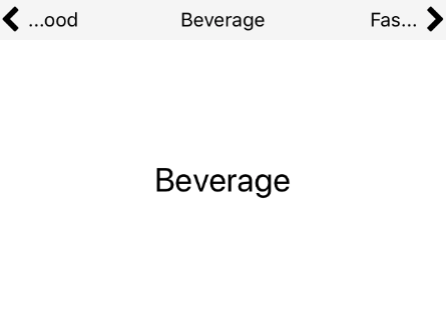

## Text Slider



### Usage

```javascript
constructor(props) {
  super(props);
  this.state = {
    dataSource: [
      { label: 'Food' },
      { label: 'Beverage' },
      { label: 'Fashion' },
      { label: 'Books' }
    ],
    position: 0
  };
}

<View style={[styles.container, { backgroundColor: 'whitesmoke' }]}>
  <TextSlider
    data={this.state.dataSource}
    onPositionChange={ (data, position) => {
      this.setState({
        position: position
      })
    }}>
    <View style={[styles.container, { backgroundColor: 'white' }]}>
      <Text style={{ fontSize: 24 }}>
        {this.state.dataSource[this.state.position].label}
      </Text>
    </View>
  </TextSlider>
</View>

const styles = StyleSheet.create({
  container: {
    flex: 1,
    justifyContent: 'center',
    alignItems: 'center',
  }
})
```

### Props
| prop | default | type | required | description |
| --- | :---: | :---: | :---: | --- |
| data | none | array[string] or array[{label}]] | optional | data source for the text slider | 
| textStyle | none | style | optional | style for the text slider | 
| iconLeftSize | none | number | optional | size of the left icon | 
| iconLeftColor | none | string | optional | color of the left icon | 
| iconRightSize | none | number | optional | size of the right icon | 
| iconRightColor | none | string | optional | color of the right icon | 
| height | 30 | number | optional | height of the tex slider | 
| maxLength | 3 | number | optional | max length of the tex slider | 
| onPositionChange | none | func | optional | function called when position is change  | 